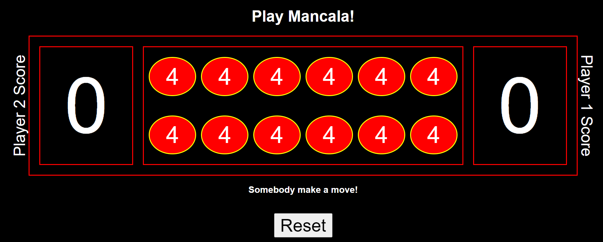

# mancala

Mancala is an ancient game played all over the world!

### Rules
- Two opposing players. Player 1 or Player 2 can go first
- Each player starts with 6 pots each containing 4 stones
- The objective is to have the most stones when the game ends
- Each player has 6 pots (circle)
- Each player has 1 bank (box)
- On each turn each player will distribute ALL stones from ONE pot placing ONE stone in each of the following pots in sequence.
- Each player has a designated DIRECTION in which they can distribute stones
- In the even that the last stone is placed in the player's bank, the player goes again
- In the event that the last stone is placed in an EMPTY pot on their OWN side, the player captures the stones in the opponent's pot DIRECTLY ACROSS and all stones (including the player's last stone) are transferred to the bank. In this case, if the opponent's pot is empty then this rule doesn't apply.
- The game ends when either player's pots (all 6) are empty

https://saifao.github.io/mancala/

