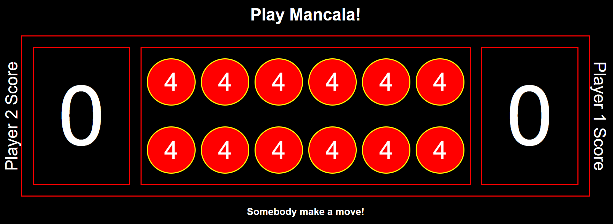
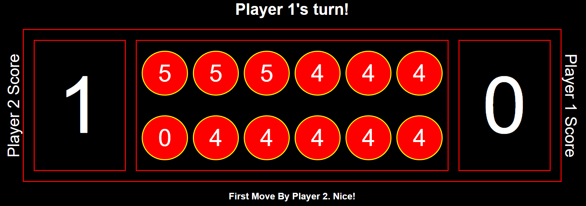
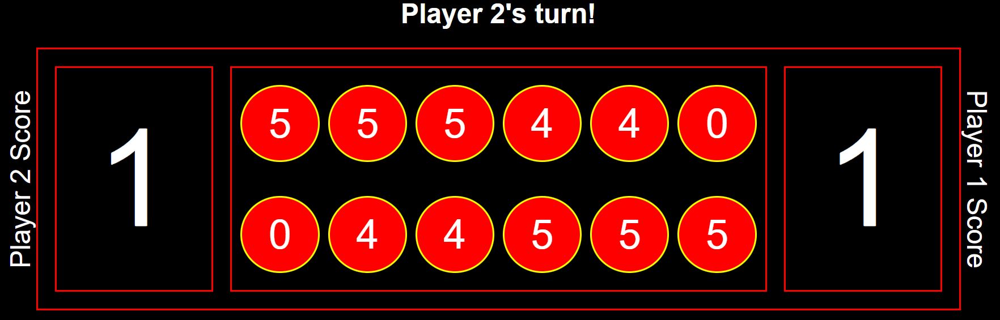
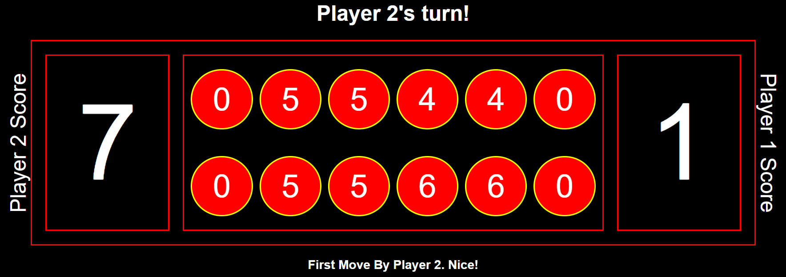
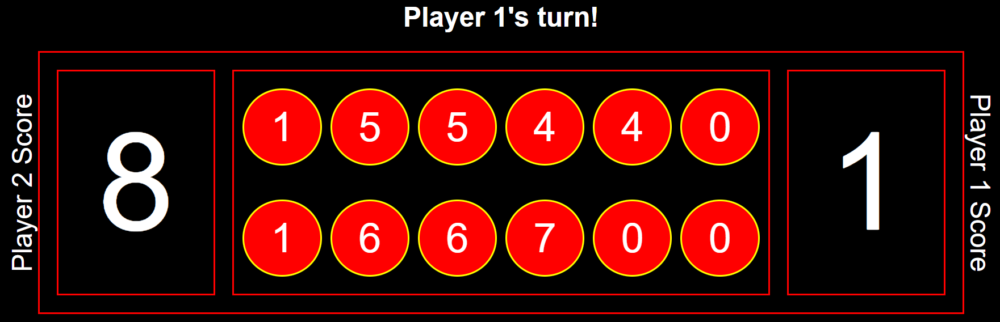
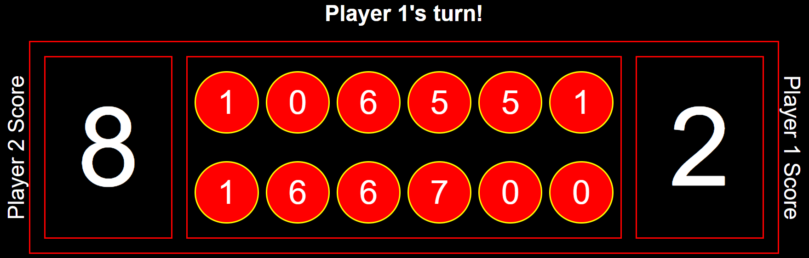
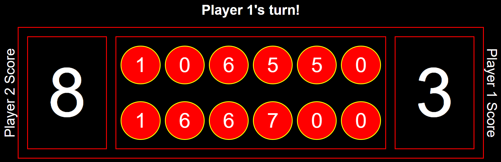

# mancala

Mancala is an ancient game played all over the world!

### Technologies Used
- JavaScript, HTML, CSS

### Rules
1. Two opposing players. Player 1 or Player 2 can go first
2. Each player starts with 6 pots each containing 4 stones
3. The objective is to have the most stones when the game ends
4. Each player has 6 pots (circle)
5. Each player has 1 bank (box)
6. On each turn each player will distribute ALL stones from ONE pot placing ONE stone in each of the following pots in sequence.
7. Each player has a designated DIRECTION in which they can distribute stones
8. In the even that the last stone is placed in the player's bank, the player goes again
9. In the event that the last stone is placed in an EMPTY pot on their OWN side, the player captures the stones in the opponent's pot DIRECTLY ACROSS and all stones (including the player's last stone) are transferred to the bank. In this case, if the opponent's pot is empty then this rule doesn't apply.
10. The game ends when either player's pots (all 6) are empty

### Play Now!
- https://saifao.github.io/mancala/

### Examples of Game States

This is how the game starts. Player 1's pots are along the top row and Player 2's are along the bottom.

In this game Player 2 has moved first by emptying their last pot containing 4 stones. Hence, 1 stone ends up in Player 2's bank (all the way on the left) and 1 stone is added to each Player 1's first three pots that occur in sequence after the bank. 

The game has progressed a little. Player 1 has emptied their last bank. Now it's Player 2's turn. Notice how Player 2 has an opportunity to make a steal described in Rule 9 above.

Player 2 places their last stone in their last pot. By doing so they are allowed to 'steal' Player 1's 5 stones in the opposite pot, and deposit all 6 stones in Player 2's bank.

The game has progressed further and now Player 1 has on opportunity to deposit 1 stone in their bank on 3 individual repeated turns. Watch!

Player 1 will play their 2nd pot from the left.

Having deposited their last stone in the bank, Player 1 repeats their turn and will play their right-most pot containing 1 stone.

Having deposited their last stone in the bank (again!), Player 1 repeats their turn and will play their left-most pot containing 1 stone. This will allow them to steal Player 2's 6 stones that sit directly across from where Player 1's last stone will land. Ultimately these 7 stones are added to Player 1's bank.

